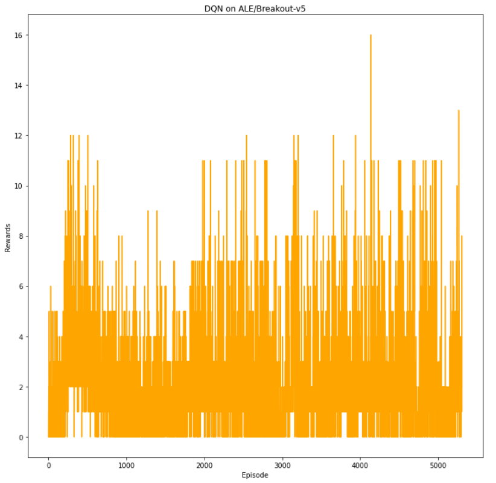
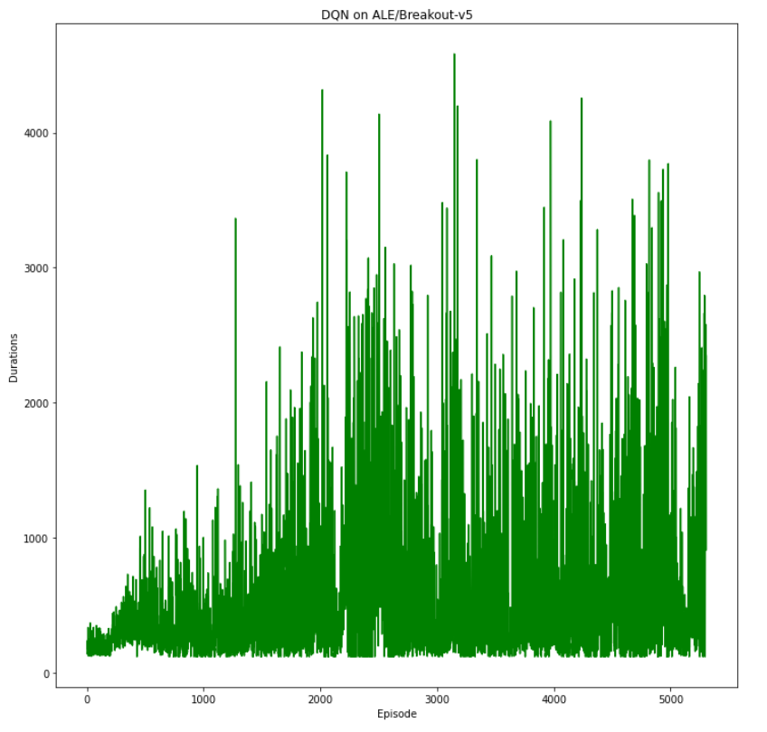

# Atari-Nature DQN

## 一、算法

​	根据DeepMind 2015年在Nature杂志上发表的一篇[paper](https://daiwk.github.io/assets/dqn.pdf)，将原来的DQN算法改进，因发表在Nature杂志上被称为**Nature DQN**，详细的算法paper中有提及，参考的[算法和代码](https://github.com/deepmind/dqn/tree/master)。

​	与前面的用在taxi上的算法相比，主要的改动为：

1. **Q网络的架构**：由于输入的是图像，因而采用的是**卷积网络层加上全连接层**，网络架构与原论文一样，**三层卷积和两层全连接层**。
2. **环境的包装与输入的预处理**：由于原DeepMind的论文对图像进行预处理，将RGB图像转换成灰度图，同时将210\*160的尺寸缩小为84\*84的尺寸，减小计算量。复现原论文的预处理步骤，用gym框架提供的**wrapper包装类**，gym提供的一种**用于修改或增强环境行为的机制，在不修改原始环境代码的情况下对环境的输出上进行处理** ，首先是image的**颜色转化和尺寸缩小操作**，然后是输出为**四张图像**，**反应观测的动态性**。
3. **训练细节**：采用pytorch的**混合精度计算**，加快强化学习的训练速度。

## 二、训练过程

​	基本上按照DeepMind的论文和提供的代码编写和训练，但是效果并不是很理想。训练较taxi要复杂，时间要长，训练10000回合需要大概8、9个小时，而且最后效果不是很理想，训练过程很不稳定，浮动较大，没有收敛，需要较大显存和内存。以下是训练可视化：

