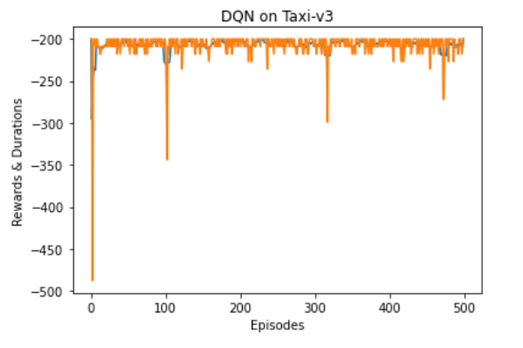
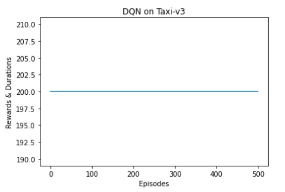
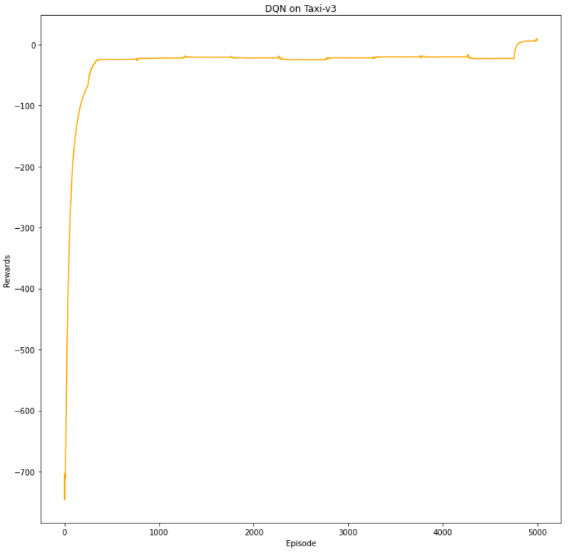
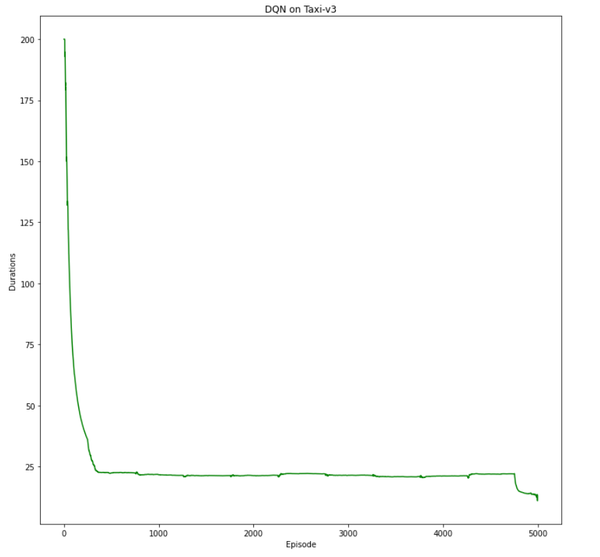
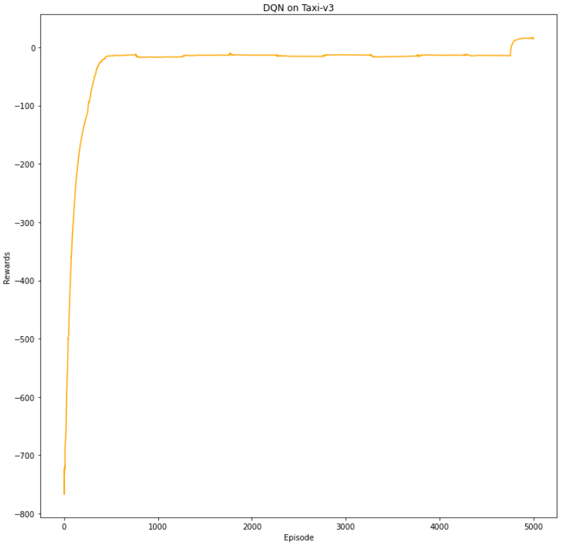
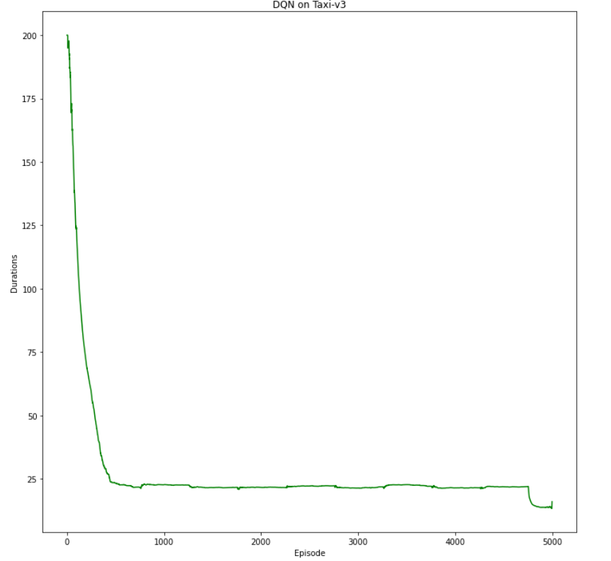

# Taxi-DQN

## 一、算法的选择-Nature DQN

​	使用OpenAI的gym环境建立taxi游戏环境，使用[DQN算法](https://arxiv.org/pdf/1312.5602.pdf)建立agent，用pytorch深度学习框架建立Q网络，DQN利用**Q网络**代替原来的Q-learning中的需要一直维护的**Q值表**，就是用**连续的函数估计代替离散的估计**，也就是**价值函数的近似估计**，从而**可以解决动作和状态空间比较复杂的问题，有效处理海量数据**。

​	Q-learning和DQN的区别：原来的Q-learning中的Q值表有两个作用，首先是用于**Q值估计并选择动作**，其次是**用于更新价值函数（选出基于下一状态的最佳动作价值函数，从Q值表中选取）**，而在DQN中**Q网络充当策略估计选择动作的作用**，但由于需要更新Q网络的参数，**需要类似Q值表的经验回放池（用于存储记录的环境的状态元组）**。经验回放池将每次和环境交互得到的奖励与状态更新情况都保存起来，用于Q网络的训练，类似有监督学习中真实数据集与预测求一个损失函数，进行网络参数的更新，而强化学习的DQN数据集是不断通过与环境交互记录真实值得到的。

​	但由于本身的DQN存在缺陷，即**用于目标Q值价值函数估计与用于更新Q值价值函数的相关性很高**，也就是一个Q网络先用于**Q值估计并选择动作**，然后又用于参数更新中的Q值估计，而往往经验回放池中的数据是具有**旧网络参数的Q网络**估计出来的选择策略，所以需要降低两者的相关性，使其训练更稳定。于是使用DQN的**改进版本[Nature DQN](https://daiwk.github.io/assets/dqn.pdf)**，建立两个Q网络，一个现有Q网络用于Q值估计并选择动作，另外一个目标Q网络用于网络参数更新中的Q值估计，而**目标Q网络中不需要更新，**现有的Q网络需要更新网络参数，而**目标Q网络的参数需要隔一段时间从现有的Q网络中复制**过来。

## 二、DQN的训练细节和改进过程

​	第一版的DQN训练过程中，我采取**固定ε值**进行训练，可能先开始的**ε值设定的过小**，导致经验回放池中的数据量过少不能充分的探索环境和选择动作，agent发现都是reward为-1的动作，于是摆烂，随意乱动甚至不动，训练的rewards一直保持-200左右，而每回合的训练步数保存在200最大限制步数。

​	如下是第一版DQN的训练可视化：





​	第二版DQN的过程中，由于不能始终将ε值保持一个较大值，后面需要逐步下降到很小值，也就是agent应该逐渐相信自己的策略判断。于是我使用ε衰减方法：

​	在强化学习中，贪婪策略中的ε-衰减是一个常见的方法，用于逐渐减小探索的随机性，从而使智能体逐渐趋向于选择更多的最优动作。以下是一般的ε-衰减方法：

1. **初始和最终值的选择**：首先，需要确定ε-贪婪策略的初始ε值和最终ε值。初始ε值通常较大，以便在训练初期进行较多的探索。最终ε值通常较小，以便在训练后期进行更多的利用。

2. **衰减的步数**：确定ε-衰减所需的步数或训练轮数。这将决定ε值从初始值逐渐减小到最终值所经过的步数。

3. **衰减函数的选择**：选择一个适当的衰减函数，以根据步数计算出ε值。常见的衰减函数包括线性衰减、指数衰减和幂函数衰减。下面是一些示例：

   - **线性衰减**：ε在每个步骤中线性减小。
     ```
     ε = ε_initial - (ε_initial - ε_final) * (current_step / total_steps)
     ```

   - **指数衰减**：ε按指数函数减小，步数越大，减小越慢。
     ```
     ε = ε_final + (ε_initial - ε_final) * exp(-decay_rate * current_step)
     ```

   - **幂函数衰减**：ε按幂函数减小，步数越大，减小越慢。
     ```
     ε = ε_final + (ε_initial - ε_final) * (1 - current_step / total_steps) ^ decay_power
     ```

4. **应用衰减函数**：在每个训练步骤或训练轮数中，根据步数计算当前的ε值，并将其用于ε-贪婪策略中。随着训练的进行，ε值会逐渐减小，智能体会更倾向于选择最优动作。

​        选择适当的衰减参数和函数取决于问题和算法。可以根据实际情况进行实验和调整，以找到合适的ε-衰减方法。在一些情况下，还可以将ε-衰减与其他技术，如经验回放、多步训练等，结合使用，以获得更好的性能和收敛性。

​	在具体的训练过程中我使用**指数衰减的形式**。

​	以下是version2中的训练可视化：





## 三、reward shaping技巧的应用

​	奖励塑形（Reward Shaping）是一种强化学习中常用的技巧，用于调整环境反馈的奖励信号，以帮助智能体更快地学习。通过适当的奖励塑形，可以改善训练的稳定性、收敛性和效率。以下是一些常见的奖励塑形技巧：

1. **稀疏奖励转稠密奖励**：在某些环境中，奖励信号可能很稀疏，智能体很难从中获得足够的信息进行学习。通过将稀疏奖励信号转换为更密集的奖励，可以帮助智能体更早地获得反馈。例如，在学习迷宫任务时，智能体可能只在到达目标点时获得正奖励，可以通过在接近目标点时逐渐增加奖励，使智能体更容易找到正确的路径。

2. **削减奖励惩罚**：如果环境中存在较大的惩罚（负奖励），可能会导致智能体避免进行探索，因为它们害怕受到惩罚。通过适当减少惩罚值，可以鼓励智能体在探索中获得更多的反馈。例如，将负奖励从 -10 减少到 -1，以便智能体不会因为惩罚而停止探索。

3. **引导技能学习**：通过适当的奖励塑形，可以引导智能体学习特定的技能或策略。例如，在机器人控制任务中，可以通过在正确的轨迹上提供额外的正奖励，以便机器人学会正确的移动方式。

4. **任务分解**：如果任务较复杂，可以将其分解为多个子任务，并为每个子任务设置适当的奖励。这有助于加速学习过程，因为智能体可以更集中地学习每个子任务。

5. **预训练器**：引入一个预训练器，该预训练器提供中间状态的奖励，从而帮助智能体更好地理解状态空间。这样可以减少奖励稀疏性问题。

6. **外部奖励函数**：使用外部的奖励函数，例如专家策略、演示数据或人类反馈，来引导学习。这可以提供更具信息量的奖励信号，加速学习过程。

在奖励塑形过程中，需要注意平衡奖励的设计，以避免引入错误信号或过度调整。过度优化奖励塑形可能导致不稳定的学习过程。因此，通过实验和调试，选择适合特定问题的奖励塑形策略是很重要的。

​	在具体的训练过程中，我使用稀疏奖励转稠密奖励，首先我考虑将加快agent智能体接送的速度，当agent接到乘客或者agent将乘客安全送达后，根据步长奖励agent，但是**训练过程中及其不稳定，容易跑飞**，我猜测是agent找到奖励机制漏洞，**反复的drop off 和 pick up乘客，以获得奖励**，于是我在非法执行drop off 和pick up动作后增大惩罚，但是训练过程还是比较缓慢并且不稳定。

​	最终我选定只在agent将乘客送达之后根据步长增加奖励，训练过程加快并且比较稳定。以下是训练的过程可视化：



